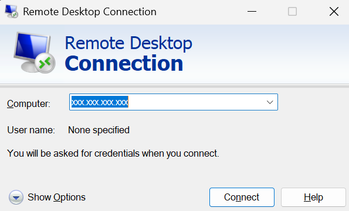
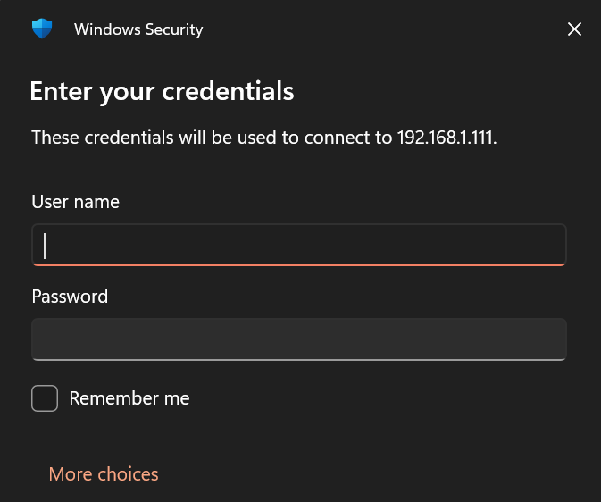
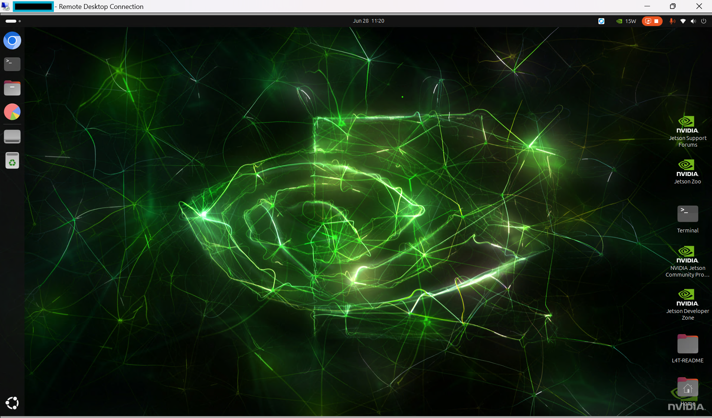
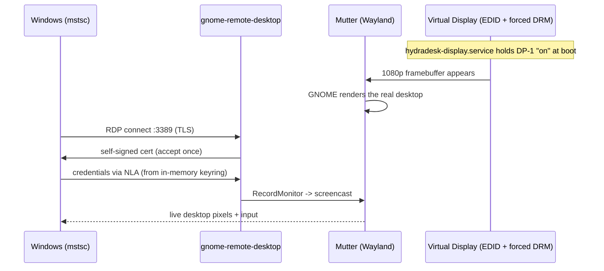

<!--
Copyright (c) 2026 HydraCodeLabs
Owner: HydraCodeLabs
Project: HydraDesk
SPDX-License-Identifier: PolyForm-Noncommercial-1.0.0
Last updated: 2026-06-27T01:32:17Z
-->

```
██╗  ██╗██╗   ██╗██████╗ ██████╗  █████╗    ██████╗ ███████╗███████╗██╗  ██╗
██║  ██║╚██╗ ██╔╝██╔══██╗██╔══██╗██╔══██╗   ██╔══██╗██╔════╝██╔════╝██║ ██╔╝
███████║ ╚████╔╝ ██║  ██║██████╔╝███████║   ██║  ██║█████╗  ███████╗█████╔╝
██╔══██║  ╚██╔╝  ██║  ██║██╔══██╗██╔══██║   ██║  ██║██╔══╝  ╚════██║██╔═██╗
██║  ██║   ██║   ██████╔╝██║  ██║██║  ██║   ██████╔╝███████╗███████║██║  ██╗
╚═╝  ╚═╝   ╚═╝   ╚═════╝ ╚═╝  ╚═╝╚═╝  ╚═╝   ╚═════╝ ╚══════╝╚══════╝╚═╝  ╚═╝
```

<div align="center">


### One command. Then RDP into your headless Linux box from Windows — and land on the real desktop.

*Turn any GNOME Linux device (even a monitor-less Jetson or Pi) into a first-class Remote Desktop target for the built-in Windows `mstsc` client.*

<br>

-7e3ff2?style=for-the-badge&logo=linux&logoColor=white)


```bash
sudo hydradesk setup
```

**That's the whole setup.** Reboot-proof. No cloud. No extra client. No monitor required.

</div>

---

## What you get

```
┌──────────────┐        standard RDP / port 3389        ┌───────────────────────────┐
│   Windows    │  ───────────────────────────────────▶  │   Headless Linux (GNOME)  │
│    mstsc     │      TLS + NLA, no extra software       │   - real physical session │
│  (built in)  │  ◀───────────────────────────────────  │   - 1080p virtual display │
└──────────────┘         the actual desktop              │   - auto-starts at boot   │
                                                          └───────────────────────────┘
```

You type `mstsc -> <linux-ip>`, accept the certificate once, and you are looking at the exact desktop that device would show on a physically attached monitor — the same session, the same windows, GPU-composited and interactive.

---

## The problem HydraDesk solves

Getting a Windows machine to remote into a Linux box *and see the genuine desktop* is a notorious rabbit hole:

- **XRDP** spins up a brand-new, separate session — not the desktop that's actually running. You get a stripped-down second desktop, or the dreaded black screen.
- **VNC** needs a real framebuffer, so on a headless device (no monitor) there is nothing to capture — black screen again — unless you buy an HDMI dummy plug.
- **RustDesk / AnyDesk / TeamViewer** work, but they need their own client, an account, and bounce your pixels through someone else's cloud relay.
- **GNOME Remote Desktop** is the right engine (it shares the real Wayland session over standard RDP) — but on a headless, auto-login device it fails silently on three separate, deeply-buried issues: no framebuffer, a locked keyring, and a screen-lock inhibitor.

HydraDesk is the tool that knows about all three and fixes them automatically.

---

## Why HydraDesk is better

| Capability | HydraDesk | XRDP | x11vnc / VNC | RustDesk / AnyDesk | NoMachine |
| --- | :---: | :---: | :---: | :---: | :---: |
| Shows the real physical desktop | **Yes** | No (new session) | Yes | Yes | Yes |
| Works headless (no monitor, no dongle) | **Yes** (auto virtual display) | Partial | No | Yes | Partial |
| Uses the native Windows client (mstsc) | **Yes** | Yes | No (VNC app) | No (own client) | No (own client) |
| No cloud, no account, stays on your LAN | **Yes** | Yes | Yes | No (relay) | Partial |
| One command, then done | **Yes** | No | No | Partial | Partial |
| Survives reboot unattended | **Yes** | Partial | Partial | Yes | Yes |
| LAN-scoped, rate-limited firewall by default | **Yes** | No | No | n/a | No |

> The one-liner: HydraDesk is the only option that gives you the actual desktop, over the built-in Windows client, on a headless box, with one command — and nothing leaves your network.

---

## Install

HydraDesk is a single self-contained binary. Pick whichever fits your device.

### Option A - Build and install on the device (recommended for Jetson / Pi / ARM)

```bash
git clone https://github.com/HydraLabsDev/HydraDesk.git
cd HydraDesk
bash install.sh --build      # builds, installs, then prompts for RDP credentials
```


### Option B - One-line install

```bash
curl -fsSL https://raw.githubusercontent.com/HydraLabsDev/HydraDesk/main/install.sh | bash
```

**What it does:** auto-detects your architecture (`x86_64` / `aarch64` / `armv7`),
prints the version it is installing, grabs a pre-built release if one exists, and
otherwise clones and builds from source for you (needs `git` + internet; it
installs Rust automatically). Force a source build with `... | bash -s -- --build`.
At the end it checks GitHub and tells you if a newer release is available.

The installer then runs `hydradesk setup`, so it prompts for the RDP username and
password during install. A few useful toggles:

| Want to… | Do this |
| --- | --- |
| Install the binary only (configure later) | `HYDRADESK_INSTALL_ONLY=1 …` |
| Force a reinstall non-interactively | `HYDRADESK_FORCE_REINSTALL=1 …` |
| Build from source instead of a release | `… \| bash -s -- --build` |

If HydraDesk is already installed, the installer detects it and offers to re-run
setup, reinstall/update, show status, or quit. If XRDP is installed (it conflicts
on port 3389), it offers to remove it first.

### Option C - Build manually with Cargo

```bash
cargo build --release --manifest-path cli/Cargo.toml
sudo install -m755 cli/target/release/hydradesk /usr/local/bin/hydradesk
```

---

## Quick start

**On the Linux device:**

```bash
hydradesk doctor    # optional: check the device is ready
sudo hydradesk setup    # configure everything; prompts for RDP user + password
hydradesk test      # confirm a client will connect AND see a desktop
hydradesk status    # show your IP, credentials, and service state any time
```

`hydradesk test` walks the whole connect path and prints `[PASS]`/`[FAIL]` for each
step (session, framebuffer, RDP, credentials, service, port), so you know it will
work *before* you reach for mstsc. `hydradesk status` also shows current RDP clients
and recent connection history when that data is available.

**Then, from Windows:**

**1. Open Remote Desktop and enter your Linux box's IP.** Press `Win + R`, type `mstsc`, press Enter, then enter the device's IP (e.g. `192.168.1.111`) under **Computer**.



**2. Enter the credentials you set during `setup`.** You'll usually need to click **More choices → Use a different account** first, then type the RDP username and password from `hydradesk setup`.



> Accept the self-signed certificate warning once — it's the normal HydraDesk cert. Cross-check its fingerprint against `hydradesk status` if you want to be sure.

**3. You're on the real desktop.**



> **Tip:** tick "Remember me" in the credential prompt so future connects are one
> click. For scripted setup that keeps the password out of your shell history:
> `printf '%s' 'STRONG_PASSWORD' | sudo hydradesk setup --username me --password-stdin`.

---

## How it works (the headless magic)

A headless GNOME box has three traps that each silently break native RDP. `hydradesk setup` defuses all of them and makes the fix permanent:

### 1. No monitor -> a synthetic 1080p display
With nothing plugged into HDMI/DP, GNOME renders to nothing, so there is no picture to send. HydraDesk installs a tiny boot service (`hydradesk-display.service`) that:
- writes a hand-built, checksum-correct 1920x1080 EDID into the DRM connector's `edid_override`, and
- forces the connector "on" via sysfs — holding it on through the boot window (the GPU driver clears a one-shot force during KMS bring-up, so we re-apply it until GNOME adopts the display).

Result: GNOME renders a real, full-HD desktop with no monitor and no dummy plug.

### 2. Auto-login -> no keyring to store credentials
`grdctl` stores the RDP password in the GNOME keyring — but an auto-login box never unlocks a persistent `login` keyring, so credential storage fails. HydraDesk points the secret-service `default` alias at the always-present in-memory `session` collection, so `grdctl` can store credentials cleanly. Because that store is in-memory, a per-login hook re-applies it on every boot.

### 3. Screen lock -> RDP session "inhibited"
GNOME refuses to start a remote session while the screen is locked (a real security feature). HydraDesk disables idle-lock/blanking and unlocks the active session, so connections always go through.

> **Optional auto-lock:** if you'd rather the physical console *did* lock when you step away, enable auto-lock during `setup` — HydraDesk then keeps the session lockable (idle-locking still off) and a watcher locks it a configurable number of minutes after your last RDP client disconnects, unlocking again when you reconnect.

> Everything above is reassembled automatically on every boot by `hydradesk-display.service` (root) plus a per-login autostart (user). You run one command; it keeps working forever.

<details>
<summary><b>Connection flow (click to expand)</b></summary>


</details>

<details>
<summary><b>What gets installed on the device</b></summary>

| Path | Purpose |
| ---- | ------- |
| `/usr/local/bin/hydradesk` | the CLI itself |
| `/usr/local/bin/hydradesk-display-init` | forces the virtual display on (hold-loop) |
| `/etc/systemd/system/hydradesk-display.service` | runs the above at every boot |
| `/usr/local/share/hydradesk/edid-1080p.bin` | the synthetic 1080p monitor descriptor |
| `/usr/local/share/hydradesk/keyring-alias.py` | points keyring `default` -> `session` |
| `~/.local/bin/hydradesk-rdp-init` | per-login: re-store creds, disable lock, start RDP |
| `~/.config/autostart/hydradesk-rdp.desktop` | runs the per-login hook on GNOME login |
| `~/.local/bin/hydradesk-lock-watch` | per-login: lock on disconnect timeout (only if auto-lock is enabled) |
| `~/.config/autostart/hydradesk-lock.desktop` | runs the lock watcher on GNOME login |
| `/etc/gdm3/custom.conf` (Debian/Ubuntu) or `/etc/gdm/custom.conf` (Fedora/RHEL) | enables auto-login (so the session exists headless) |

Nothing is hidden — every generated file is plain text you can read, audit, or remove.
</details>

---

## Command reference

| Command | What it does |
| ------- | ------------ |
| `hydradesk doctor` | Full readiness report — desktop, Wayland, session, monitor, grdctl, port, firewall, with fix hints. |
| `sudo hydradesk setup` | The one-shot installer: deps -> virtual display -> auto-login -> RDP -> persistence -> verify. Prompts for credentials. |
| `printf '%s' 'P' \| sudo hydradesk setup --username U --password-stdin` | Non-interactive credentials without putting the password in shell history. |
| `sudo hydradesk setup --username U --password-file /path/to/password.txt` | Read the RDP password from a local file. |
| `sudo hydradesk setup --no-firewall` | Skip the `ufw` / `firewalld` rule for port 3389. |
| `sudo hydradesk setup --lock-timeout 5` | Auto-lock the screen 5 minutes after the last RDP client disconnects (`0` = never). |
| `hydradesk lock` / `hydradesk unlock` | Lock or unlock the physical screen on demand. |
| `hydradesk status` | Show IP, username, monitor mode, RDP/port/service state, and the TLS fingerprint. |
| `hydradesk logs` | Show recent GNOME Remote Desktop logs. Use `--follow` to watch live. |
| `sudo hydradesk uninstall` | Remove services, generated files, and the binary. |
| `hydradesk fix` | Auto-repair the most common breakages (service down, firewall, missing package). |
| `hydradesk debug` | Dump raw system state, the RDP journal, open ports, and firewall rules. |

---

## Security

HydraDesk is built for a trusted device on your own network. What it does by default, and what is on you:

**Hardening HydraDesk applies automatically**
- **NLA / CredSSP** — clients must authenticate before a session is created (GNOME Remote Desktop default).
- **TLS in transit**, and `hydradesk status` / `setup` print the certificate **fingerprint** so you can confirm it matches what mstsc shows (defends against MITM on first connect).
- **LAN-scoped, rate-limited firewall** — when `ufw` is active, HydraDesk adds `ufw limit from <your-/24> to any port 3389` instead of opening 3389 to the world; on `firewalld` (Fedora/RHEL) it adds an equivalent LAN-scoped, rate-limited rich rule. Rate-limiting blunts brute-force.
- **Strong credentials** — `setup` prompts (with confirmation, no echo) and **refuses weak/common passwords**.
- **A public-IP warning** if the device looks internet-facing.

**On you, the operator (important)**
- **Do not port-forward 3389 to the internet.** Reach the box over a **VPN / Tailscale / WireGuard / SSH tunnel** and keep RDP on the LAN. Exposed RDP is a top ransomware vector.
- **Full-disk encryption (LUKS).** On an auto-login box with no unlockable keyring, the RDP password necessarily lives in a `0700`, user-owned login script and the in-memory keyring. FDE is what protects that secret when the device is off or stolen.
- **Keep the system patched** (`unattended-upgrades`) — freerdp/RDP CVEs matter.
- **Physical security.** Auto-login means the desktop is live at the console. By default the screen does not lock (so RDP can always reattach); enable **auto-lock on disconnect** during `setup` (or `hydradesk lock`) if the device sits somewhere people can walk up to it. Combine with FDE and a locked location.
- Consider a **dedicated, non-sudo user** for remote access so stolen RDP credentials don't equal instant root.
- For releases, publish and check **checksums** so `curl | bash` users can verify the download.

---

## Supported hardware and OS

- **NVIDIA Jetson** (Orin / Xavier / Nano) — primary target, tested on Orin + Ubuntu 24.04 / GNOME 46.
- **Raspberry Pi** running a GNOME desktop.
- **Ubuntu / Debian / Pop!\_OS / Mint** desktops, NUCs, mini-PCs, Linux laptops.
- **Fedora / RHEL** (and derivatives) running GNOME — `dnf`, `/etc/gdm/custom.conf`, and `firewalld` are handled automatically.
- Architectures: `x86_64`, `aarch64`, `armv7`.

**Requirements:** GNOME on **Wayland**, `gnome-remote-desktop` >= 42, systemd, and either `apt` (Debian/Ubuntu) or `dnf` (Fedora/RHEL). HydraDesk installs `gnome-remote-desktop` and `python3-dbus` for you if they are missing.

**This is not a universal "all distros" tool, by design.** It will not work on KDE/XFCE/LXDE (no `grdctl`), X11-only sessions, or non-systemd distros / distros without `apt` or `dnf`. The headless virtual-display trick also depends on the GPU driver honoring a forced DRM connector (works on Tegra / Intel / AMD; not guaranteed on every driver). On unsupported systems `hydradesk doctor` tells you exactly why instead of failing strangely.

---

## Troubleshooting

<details>
<summary><b>mstsc: "unexpected server authentication certificate"</b></summary>

That is the normal self-signed cert. In mstsc -> Show Options -> Advanced -> "If server authentication fails" -> Connect and don't warn me, or just click Yes / Connect anyway. Cross-check the fingerprint against `hydradesk status`. Nothing leaves your machine.
</details>

<details>
<summary><b>Black screen for a second, then disconnect</b></summary>

The desktop is not being rendered yet. Run `hydradesk doctor` — if Monitor shows headless and the virtual display did not come up, restart it:
```bash
sudo systemctl restart hydradesk-display.service
```
Then reconnect.
</details>

<details>
<summary><b>Connected, but I can see it and cannot control it</b></summary>

View-only mode. `sudo hydradesk setup` disables it, but you can also run:
```bash
grdctl rdp disable-view-only && systemctl --user restart gnome-remote-desktop.service
```
</details>

<details>
<summary><b>Works now, breaks after reboot</b></summary>

Confirm both halves of the persistence are in place:
```bash
systemctl is-enabled hydradesk-display.service        # -> enabled
ls ~/.config/autostart/hydradesk-rdp.desktop          # -> exists
```
Re-run `sudo hydradesk setup` if either is missing.
</details>

---

## Uninstall

The clean way — one command:

```bash
sudo hydradesk uninstall
```

Or, without the binary, from a checked-out repo:

```bash
bash install.sh --uninstall
```

Or straight from the web (no checkout needed):

```bash
curl -fsSL https://raw.githubusercontent.com/HydraLabsDev/HydraDesk/main/install.sh | bash -s -- --uninstall
```

Either one stops and disables the display service, turns off RDP, and removes every file HydraDesk created (including the binary). It intentionally leaves GDM auto-login and the `gnome-remote-desktop` package in place — disable auto-login in your GDM config (`/etc/gdm3/custom.conf` on Debian/Ubuntu, `/etc/gdm/custom.conf` on Fedora/RHEL) and remove the package with `apt`/`dnf` if you want those gone too.

<details>
<summary><b>Fully manual teardown</b></summary>

```bash
sudo systemctl disable --now hydradesk-display.service
sudo rm -f /usr/local/bin/hydradesk /usr/local/bin/hydradesk-display-init \
           /etc/systemd/system/hydradesk-display.service
sudo rm -rf /usr/local/share/hydradesk
rm -f ~/.local/bin/hydradesk-rdp-init ~/.config/autostart/hydradesk-rdp.desktop
sudo systemctl daemon-reload
```
</details>

---

## Roadmap

- [ ] Selectable virtual-display resolution (4K / multi-monitor)
- [ ] X11-session fallback path (with a clear "this is a virtual session" warning)
- [ ] NoMachine auto-install path for non-GNOME desktops
- [ ] Optional fail2ban jail for repeated RDP auth failures

---

## Licensing

HydraDesk is licensed under the **PolyForm Noncommercial License 1.0.0** — free to use, copy, modify, and distribute for any noncommercial purpose. Commercial use (including selling it) requires a separate license from HydraCodeLabs, who retains copyright.

- **[TERMS.md](TERMS.md)** — plain-language summary of what you can and can't do (start here).
- **[LICENSE](LICENSE)** — the full, binding license text.

HydraDesk names, logos, and brand assets are owned by HydraCodeLabs. Third-party dependency notices are listed in [THIRD_PARTY_NOTICES.md](THIRD_PARTY_NOTICES.md).

---

<div align="center">

**Built by HydraCodeLabs** - PolyForm Noncommercial 1.0.0

*Powered by [GNOME Remote Desktop](https://gitlab.gnome.org/GNOME/gnome-remote-desktop) - written in Rust*

</div>
